# 网易前后端分离实践

各位同学晚上好，我叫蔡剑飞，目前就职于网易杭州研究院前端技术部前端框架组，今天我主要结合网易在前后端分离上的一些工程实践方案跟大家一起探讨交流一下前后端分离的话题

> 注：今天的分享图片较多，使用流量的同学慎入，另外发在群里的动图尺寸会比较小，每个动图后面都会配有原图地址，流量充裕的同学可以通过查看原图看到更清晰的内容

## 内容

今天的内容我们主要从以下几个方面来介绍

* 背景介绍
* 解决方案
* 协作体系
* 操作展示
* 专题总结

## 背景介绍

前后端分离也是一个比较古老的话题了，我想各大企业应该都有适合自己的解决方案，这里我就不再赘述为什么要做前后端分离了，在介绍我们的前后端分离方案之前我先简单介绍一下杭研这边项目的一个大致情况

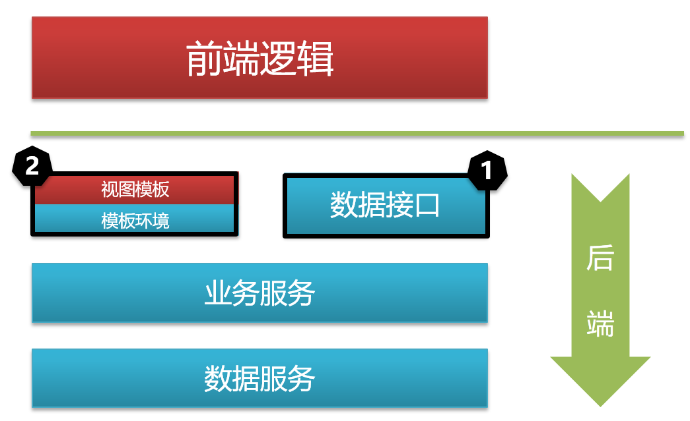

这是目前杭研大部分新老项目中WEB系统的一个高层级分层模型，在这个模型中红色部分表示前端要做的事情，蓝色部分表示后端要做的事情，中间绿线分隔前端和后端可以解耦出来的内容

在这种模型下我们可以看到：

1. 数据接口： 前后端基本没有太大耦合性，分离还算比较容易
2. 视图填充： 很多项目由前端负责的视图模板重度依赖于后端的模板环境

所以我们在设计方案时就专注于寻求一种可以彻底分离绿线上下两部分的解决方案，当然除此之外我们还有其他的一些需求的考量比如规范化、自动化等等，最终能够输出一套固化的工程解决方案来指导优化新老项目的开展

在寻求解决方案之前我们首先需要了解我们要解决的问题，结合网易杭研项目的情况我们从数据接口和视图填充两部分来说明

* 数据接口的问题

	1. 缺少可持续维护的接口规范，这个问题主要表现为：
	
		* 没有规范
		* Word文档/Doc平台 编写规范
		* 随着项目的迭代规范与实际不一致
	
	2. 缺少对规范数据的充分利用，没有规范的就不说了，这里针对有规范的情况下，这个问题主要表现为：
	
		* Word文档/Doc平台 编写的规范利用率低，无法做自动化工作，后期维护困难
		* 使用接口管理平台管理的规范只用于mock数据、测试接口，项目的迭代导致规范的一致性问题
	
	3. 缺乏规范覆盖范围的广度，没有使用工具或平台管理规范的就不说了，这里针对使用了这些平台管理规范的情况下，这个问题主要表现为：
	
		* 平台只能定义异步请求的数据接口规范

* 视图填充的问题

	1. 紧耦合于后端模板环境
	
		需要后端先给配置路由规则、模板环境、预填数据等才能查看页面效果
	
	2. 编译运行后端服务效率低
	
		随着后端完成的功能越来越多本地编译启动后端服务的时间越来越长，严重影响到了前端的开发效率
	
	3. 缺少对视图模板的接口规范
	
		从广义的接口定义看只要不同部分存在相互协作的约束规范即可视为接口进行管理，所以模板视图和模板环境之间也应该做为接口进行规范化管理

## 解决方案

接下来我主要介绍一下我们目前在这方面实践的解决方案，以下是我们目前实施的前后端分离体系的全貌图

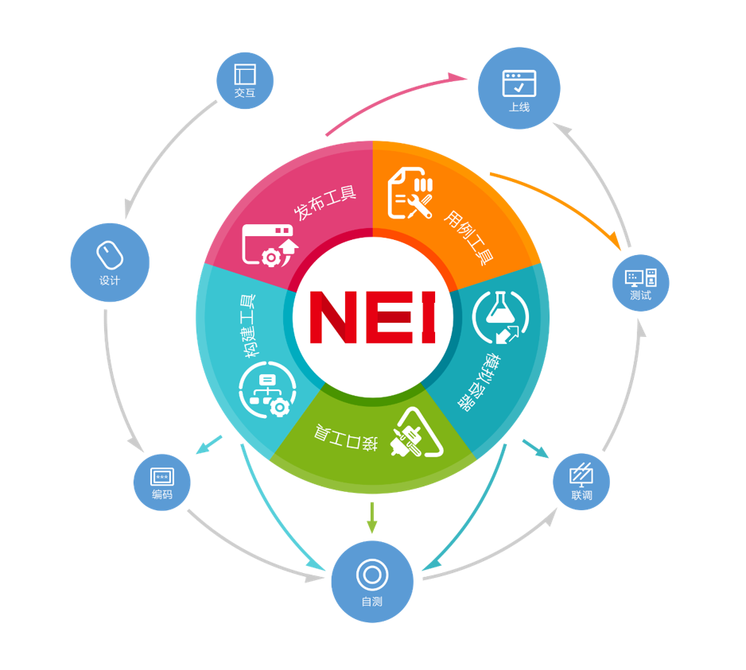
	
该方案是一套集规范、工具、平台于一体的工程化解决方案，主要目标在于帮助产品在已有的项目基础上以最小的成本实现规范化、工程化的高效开发协作体系，通过项目各个环节的密切配合实现一个闭环可验证的体系，以保证各个环节使用的规范的一致性

在上图中我们可以看到整套解决方案以NEI（接口管理平台，网易内部平台名称）为中心，辅以各种效率工具，支持项目从交互到上线的各个环节，接下来我主要介绍一下这套解决方案是如何来帮助我们解决上面碰到的问题的

* 针对数据接口问题

	对于数据接口这部分在我们的解决方案中主要是使用接口管理平台来管理接口，业内可用的接口管理平台也比较多，如RAP、EasyAPI、StopLight、Swagger等等，但是我们的这个接口管理平台到底要管理哪些接口这个是我们要考虑的问题，因为能用这个平台管理的说明是符合某种规范的，符合规范的东西我们说就可以拿来做自动化处理，所以我们需要尽可能多的去发现这类可以规范化管理的接口

	接下来我们以一个通用的WEB系统为例，来看一下哪一些东西可以以接口的形式用接口管理平台来做规范化管理
	
	

	[大图地址](http://youfan.netease.com/res/ita1024/pic-4.gif)

	这是一个比较常见的带异步数据载入的页面从输入地址到整个页面绘制出来的过程，通过这个过程我们就可以抽取出前后端都需要关注的几个元素，这几个元素之间的关系我们可以用以下方式来标识

	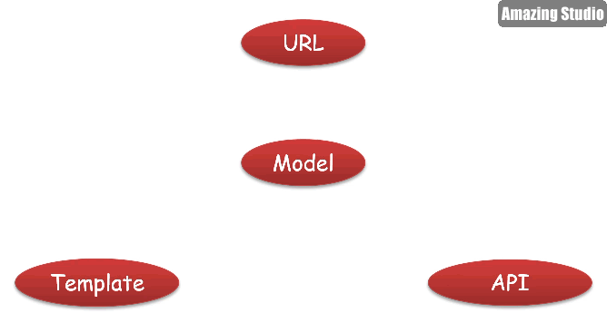

	[大图地址](http://youfan.netease.com/res/ita1024/pic-5.gif)

	这里每个关系对应的前后端关注的内容主要包括：

	* URL对应的页面逻辑由前端来完成，而这个页面需要用哪个模板来填充则需要后端来配置，所以在这个关系中我们需要定义个页面与模板之间映射关系的规范
	* URL对应的页面需要发送哪几个异步请求加载数据的过程由前端完成，而异步接口的具体实现则由后端来完成，所以在这个关系中我们需要定义页面与使用的异步接口之间映射关系的规范
	* 模板的里的结构和填充数据的过程由前端来完成，而填充的数据模型由后端来组装，所以在这个关系中我们需要定义每个模板与预填的数据模型之间对应关系的规范
	* 异步接口的使用（输入输出）由前端来控制，而接口的具体实现由后端来完成，所以在这个关系中我们需要定义接口与输入、输出的数据模型之间对应关系的规范
	
	到这里我们可以发现我们的接口管理平台可以用来管理的规范包括：

	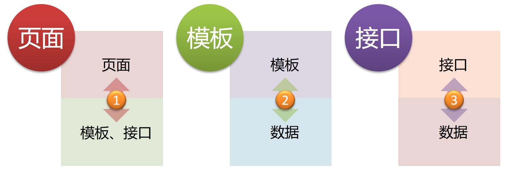

	* 页面规范：定义页面与模板和接口的关系
	* 模板规范：定义模板与预填数据模型的关系
	* 接口规范：定义接口与输入输出数据模型的关系

* 针对视图填充问题

	对于视图填充这部分业内也有比较多的解决方案，如SPA、代理转发、服务器中间层、本地模拟容器等等，在我们的解决方案中我们主要引入了开发阶段的本地模拟容器，选择此方案主要基于以下几个方面考虑：

	* 网易现有大量产品重度依赖于服务器端模板Freemarker，解决方案需要考虑老项目能够无缝接入
	* 服务端已有的一些成熟解决方案可继续使用，比如SpringMVC的多视图能力等
	* 通过对模拟容器支持的模板的扩展可适用到新的项目环境，比如PHP、Node等

	有了本地模拟容器后我们的前后端分离过程就类似如下图所示

	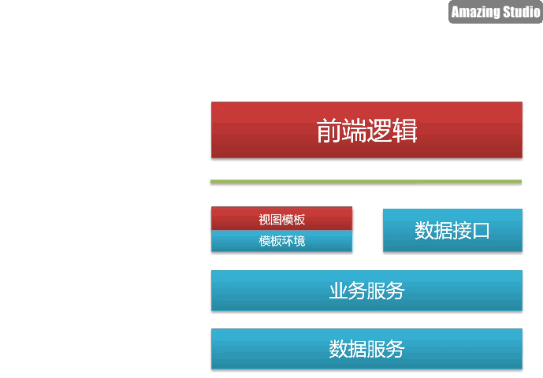

	[大图地址](http://youfan.netease.com/res/ita1024/pic-a1.gif)

	可以看到这种方案下我们的主要思路是在开发阶段引入一个可以解析模板的容器，而产品上线发布后仍然运行在已有的后端模板环境中，容器对模板的解析能力可按需进行扩展

## 协作体系

有了前面我们对这套解决方案的整体认识后，接下来我们再来看一下各端在该解决方案的指导下是如何进行协作的

[大图地址](http://youfan.netease.com/res/ita1024/pic-b.gif)

这是WEB系统前后端协作的流程，移动端和后端的协作也类似，这里前后端的设计过程主要是系统设计过程而非视觉的效果设计过程，这个流程中我们可以看到在有了交互输出之后，各角色（包括视觉、前端、后端、移动端）就可以并行的开始展开各自的流程了，那么我们具体是怎么来保证这其中各角色独立并行的流程顺利、有序、高效进行的呢？ 下面我们还是以前后端流程为例来说明，如下图所示

[大图地址](http://youfan.netease.com/res/ita1024/pic-c.gif)

在解决方案中我们可以看到在系统设计阶段各端根据交互稿利用接口管理平台输出接口规范，后续流程各端针对接口规范进行编码、自测，所以这里接口规范是整个方案的核心，是保证各端可以独立并行的先决条件，前面我们对解决方案的分析可以看到单纯只有接口规范还不足以让我们能够顺利高效的完成各端的分离，因此我们的解决方案又提供了多种工具来支持各端分离的过程，其从交互到测试过程之间的完整流程如下图所示

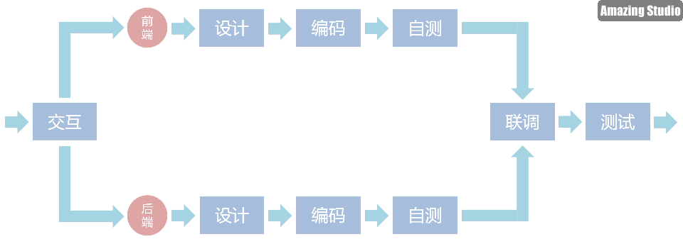

[大图地址](http://youfan.netease.com/res/ita1024/pic-d.gif)

从上面的流程中可以看到在我们解决方案的整个体系中涉及的平台、工具包括：

* 接口管理平台： 该平台主要用来管理接口规范数据，是整个解决方案的核心，有了规范以后就可以做自动化，后续各效率工具均可以从该平台获取规范信息做自动化相关工作
* 工程构建工具： 根据接口管理平台的规范定义，配合项目已有的工程规范，自动生成项目工程、工具配置、页面代码、模拟数据、测试代码、用例数据等等
* 本地模拟容器： 提供给前端开发过程用于本地运行调试页面的环境，具备WEB服务基本功能、模板解析、请求代理等功能
* 接口测试工具： 提供给后端开发、测试过程用于模拟浏览器发起异步请求，工具对接接口管理平台直接导入规范信息、管理测试人员的用例数据、支持直接导出自动化测试代码和用例数据

接下来我们再来看一下各角色在此方案下是如何独立开展各自的流程

* 前端

	这是前端本地开发的整个过程
	
	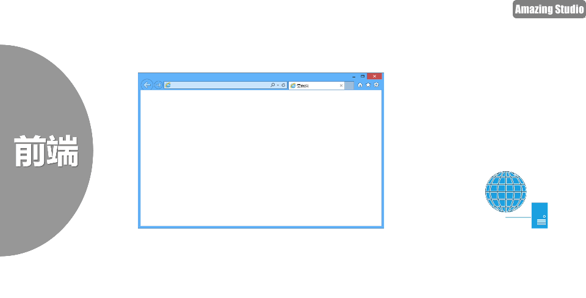
	
	[大图地址](http://youfan.netease.com/res/ita1024/pic-e.gif)
	
	前端借助于接口管理平台和本地模拟容器从后端独立出来，通过接口管理平台获取到页面预填、异步接口的mock数据（这个过程也可以脱离接口管理平台在本地mock），通过本地模拟容器隔离真实服务环境完成WEB服务、模板解析和请求代理功能

* 后端

	这是后端本地开发的整个过程
	
	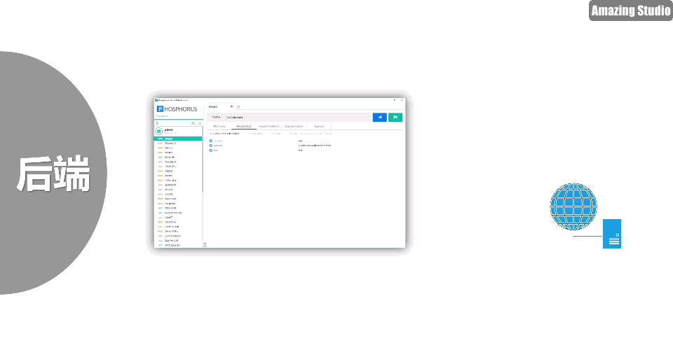
	
	[大图地址](http://youfan.netease.com/res/ita1024/pic-f.gif)
	
	后端（或者测试）借助于接口测试工具从接口管理平台导入规范信息模拟浏览器发起请求进行接口测试，支持缓存历次测试用例数据，帮助导出自动测试代码和用例数据

* 移动

	这是移动端本地开发的整个过程
	
	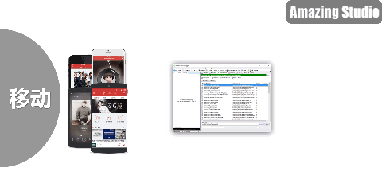
	
	[大图地址](http://youfan.netease.com/res/ita1024/pic-g.gif)
	
	移动端我们主要借助第三方代理工具或者本地模拟容器来做接口代理，通过工程构建工具直接对接接口管理平台导出所有接口的mock数据，同时根据使用的代理工具的差异导出不同工具的离线或在线配置文件（目前支持Fiddler、Charles）

* 测试

	测试是保证接口管理平台规范一致性的重要环节，项目提测之后首先要做的是一次规范验证，如果规范验证被认为是失败的，那么此次提测会被打回重新检查
	
	
	
	[大图地址](http://youfan.netease.com/res/ita1024/pic-h.gif)
	
	这个过程我们主要借助工程构建工具对接接口管理平台导出测试代码和用例数据工程，这个工程可以整个到自动测试集成平台上自动运行，在规范验证失败的时候会通知到相应开发和测试重新检查接口平台定义的规范与实际提测的规范的一致性

## 操作展示

为了给大家有个直观的感知，我们接下来用一个简单的案例来讲解一下该方案中从交互到测试流程的具体操作（此次专题我们主要分享前后端分离相关的内容，所以这里暂时省略了部署发布、监控相关的流程，后面有机会可以再进行相关专题的交流），我们以如下图的交互稿为例

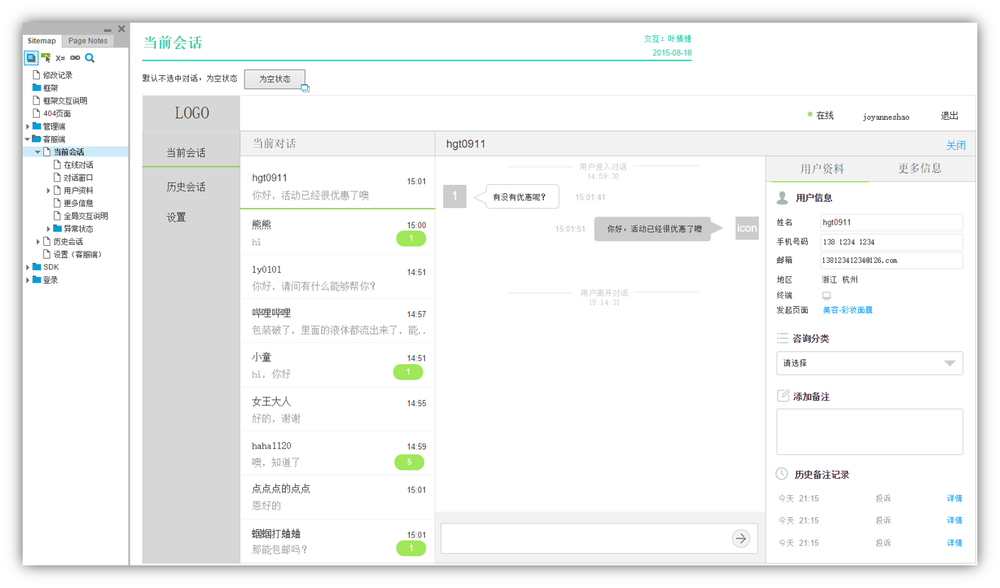

1. 系统设计阶段

	系统设计阶段主要是各端开发工程师针对产品需求说明、交互设计稿开始设计系统架构、拆分子系统、划分子系统模块、协调端与端之间的接口规范，这个阶段各端根据实际情况输出若干系统设计说明书等文档，除此之外更重要的是输出端与端之间协作的接口规范，而这个规范则可以借助接口管理平台来完成，如下图所示
	
	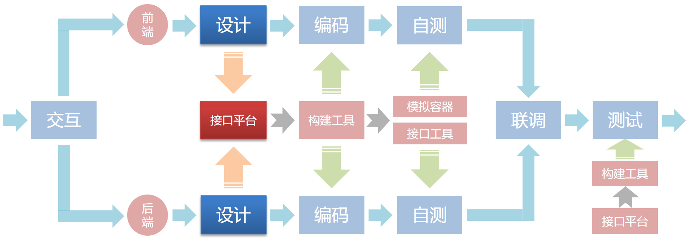
	
	我们解决方案中的接口管理平台主要以页面为主线来组织整理每个系统，每个页面会使用若干的模板进行填充，可以发送若干的异步接口来操作数据，所有这些页面、模板、接口可以用统一的数据模型进行抽象
	
	

	[大图地址](http://youfan.netease.com/res/ita1024/pic-j.gif)

	接下来我们简单了解一下我们的接口管理平台

	

	[大图地址](http://youfan.netease.com/res/ita1024/pic-k.gif)

	页面在接口管理平台上定义就可以如下图所示

	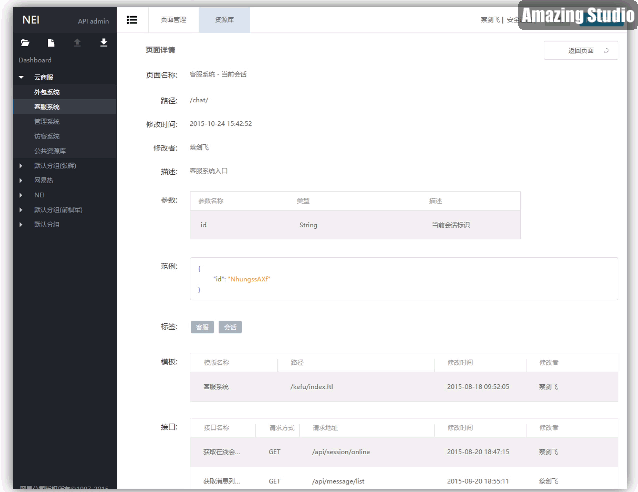

	[大图地址](http://youfan.netease.com/res/ita1024/pic-l.gif)

	根据前面的介绍我们需要定义的规范包括：

	* 模板
	* 接口
	* 页面

	1. 定义模板规范
	
		模板规范的定义主要包含两部分：模板文件路径、模板预填数据，在接口管理平台的模板定义如下图所示

		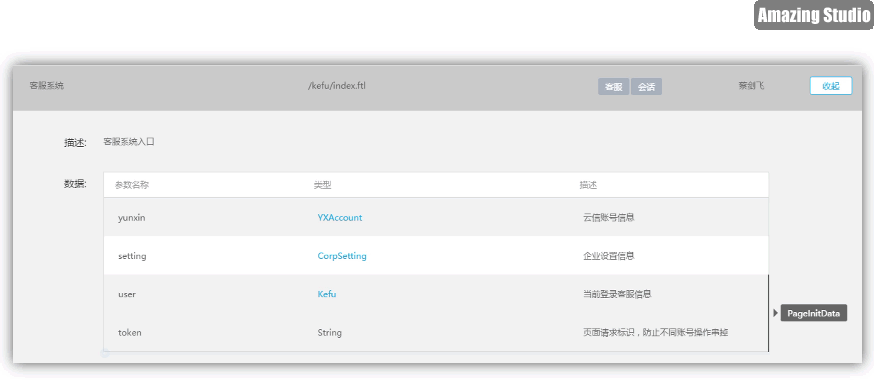

		[大图地址](http://youfan.netease.com/res/ita1024/pic-m.gif)

		模板预填的数据模型由两部分组成：通用数据（所有页面都需要预填）和特有数据（某个页面特有的数据），在接口管理平台我们可以先定义一个这样的通用数据类型
	
		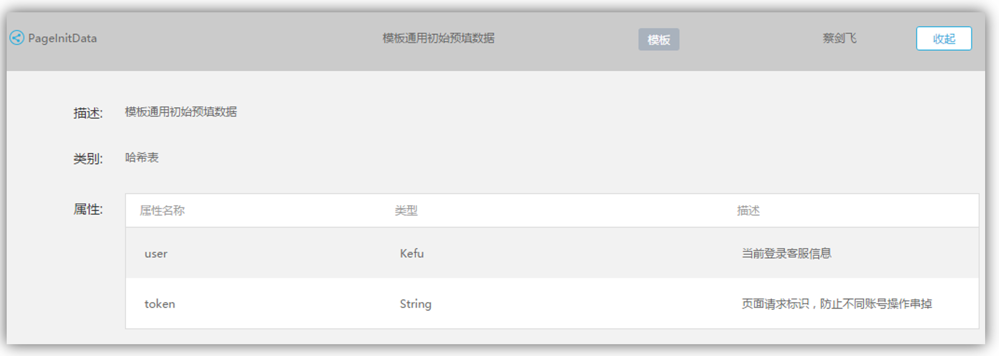

		在每个页面可以先导入这个通用数据，然后再定义页面特有数据，这样我们针对所有页面预填数据后期只需要维护一个通用的数据即可

		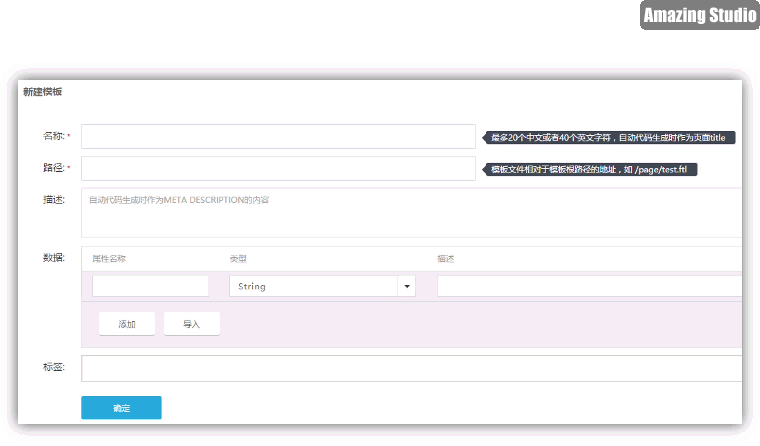

		[大图地址](http://youfan.netease.com/res/ita1024/pic-o.gif)

	2. 定义接口规范

		同模板规范类似，针对接口规范我们也可以先预定义一些通用的数据，如下图所示，我们可以定义一个通用的响应的数据结构

		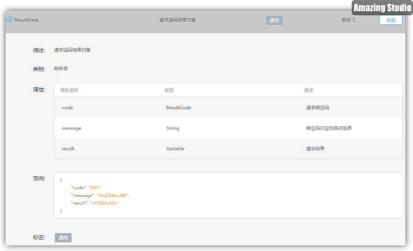

		[大图地址](http://youfan.netease.com/res/ita1024/pic-p.gif)

		或者定义一个通用的分页请求和响应的数据结构

		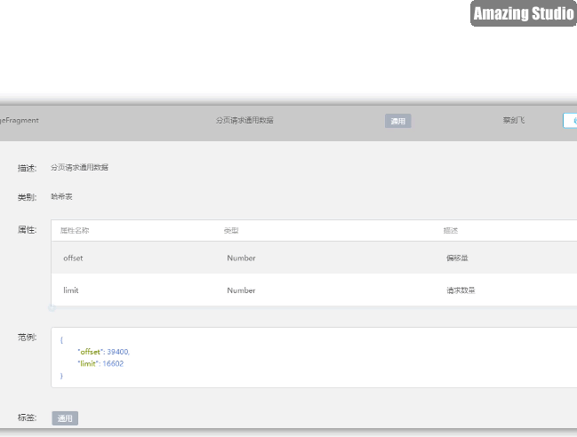

		[大图地址](http://youfan.netease.com/res/ita1024/pic-q.gif)

		所有这些通用的数据接口中根据不同接口可变的字段使用可变类型标记，然后我们从交互稿中抽取出页面用到的接口，如下图所示

		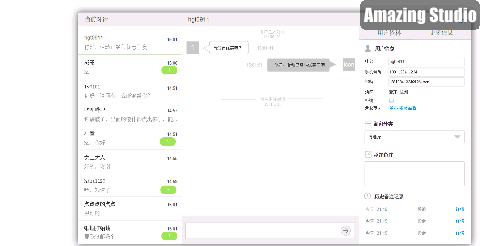

		[大图地址](http://youfan.netease.com/res/ita1024/pic-r.gif)

		根据交互稿抽取接口使用的数据结构

		

		[大图地址](http://youfan.netease.com/res/ita1024/pic-s.gif)

		最后完成接口规范的定义

		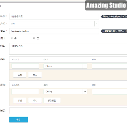

		[大图地址](http://youfan.netease.com/res/ita1024/pic-t.gif)

	3. 定义页面规范

		在接口管理平台定义页面规范的过程如下图所示

		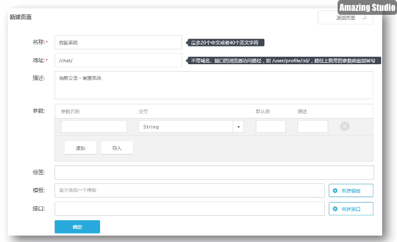

		[大图地址](http://youfan.netease.com/res/ita1024/pic-u.gif)

2. 编码阶段

	编码阶段主要是开发工程师根据系统设计阶段的输出，用代码来实现系统，包括技术方案的选型、项目框架的搭建、工具及环境的配置等，而在这个阶段我们则可以借助构建工具来对接接口管理平台帮我们做很多自动化的工作，进而提升我们的开发效率

	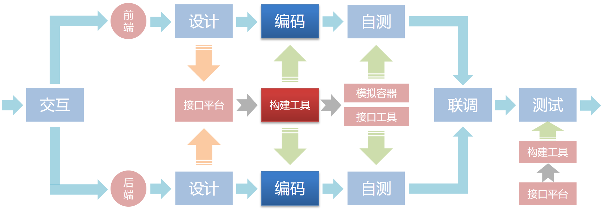

	以下是我们利用构建工具结合项目规范通过对接接口管理平台自动生成项目工程的过程

	

	[大图地址](http://youfan.netease.com/res/ita1024/pic-w.gif)

	根据我们的默认规范生成的项目结构中几个主要内容如下图所示

	

	[大图地址](http://youfan.netease.com/res/ita1024/pic-x.gif)

3. 自测阶段

	自测阶段主要是各端的工程师验证自己编写的代码的正确性，按角色不同，测试方式也有所有不同，比如对于前端和移动端工程师来说，主要是需要测试各种可能的值会不会影响界面展示；对于后端工程师来说，主要是测试提供给客户端工程师使用的接口的正确性，对不同的输入参数是否返回了预期的结果

	* 前端自测

		对于前端自测阶段我们主要提供本地模拟容器来完成自测

		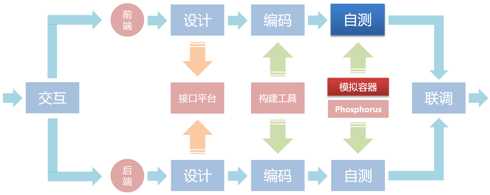

		根据自动生成的项目工程，通过bower安装依赖包后我们就可以通过以下方式运行模拟容器进行功能自测

		

		[大图地址](http://youfan.netease.com/res/ita1024/pic-z.gif)

		代码自动生成的时候也会为工程生成一份本地的mock数据，前端也可以通过配置成离线模式调整本地的mock数据直接查看不同情况下的展示效果

		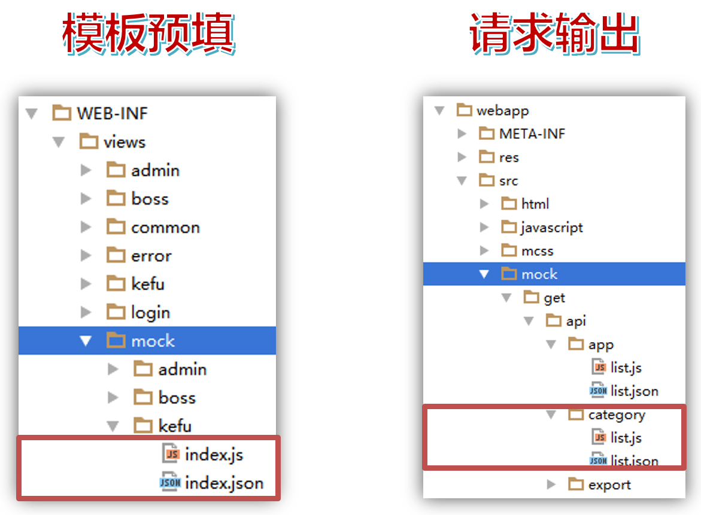

	* 后端自测

		对于后端工程师我们主要提供接口测试工具来完成自测

		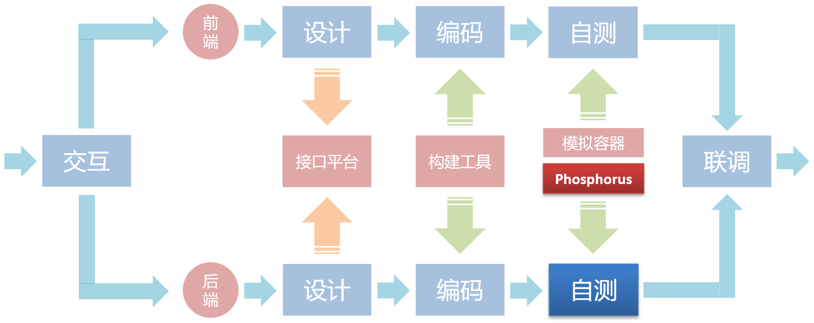

		这里的Phosphorus是我们提供的测试工具的名称，是一个Chrome的插件，操作交互类似Postman，具体效果如下图所示

		

		[大图地址](http://youfan.netease.com/res/ita1024/pic_03.gif)

4. 联调阶段

	联调阶段主要是在各端完成各自的业务逻辑后进行对接测试

	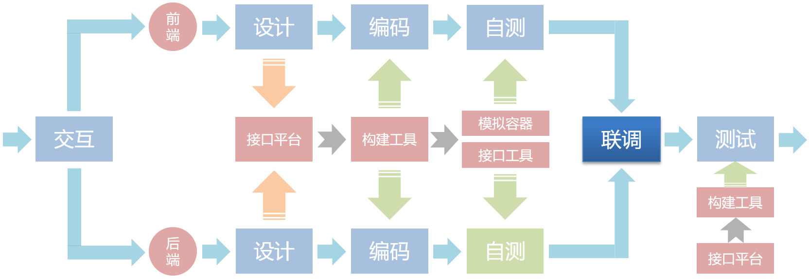

	这个阶段相对比较简单，只要各端按照系统设计阶段约定的规范进行，这个阶段只要回归一下即可，下图是本地模拟容器的路由配置文件，这个文件由构建工具自动生成

	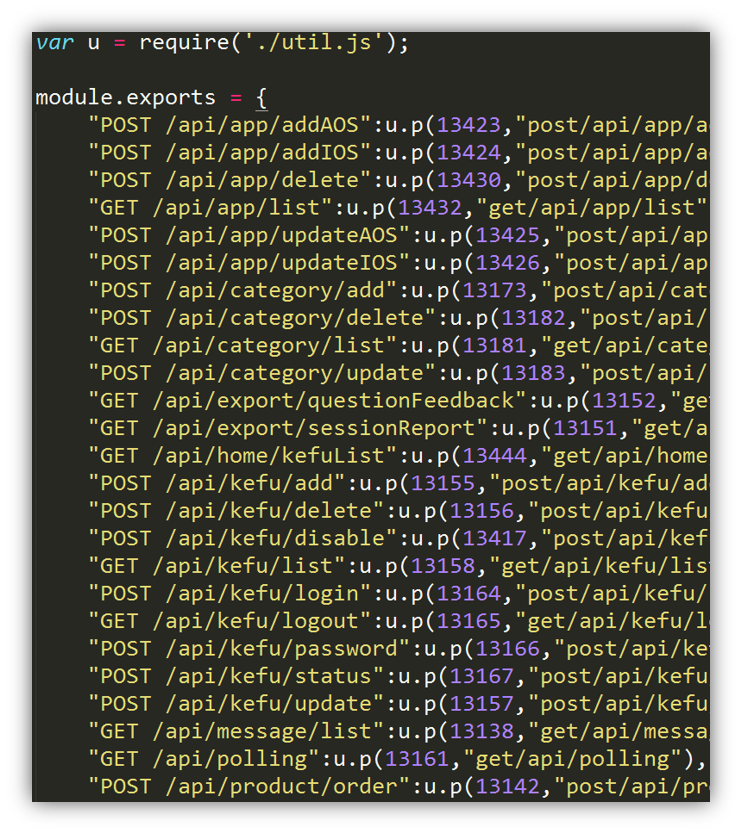

	这个阶段我们只需要调整一下路由配置即可实现单个接口、多个接口、全部接口的联调过程，如下图所示

	

	[大图地址](http://youfan.netease.com/res/ita1024/pic_06.gif)

5. 测试阶段

	测试阶段是各端开发工程师完成联调后部署到测试环境提交给测试工程师进行更全面测试的过程，此阶段测试工程师会对接接口管理平台自动生成接口测试用例代码并集成到自动化测试平台运行，如果接口管理平台的接口定义与实际提测的接口不符则此次提测失败，需由开发对照接口管理平台检查接口实现情况，通过该阶段可以保证接口管理平台上的接口定义始终与线上保持一致

	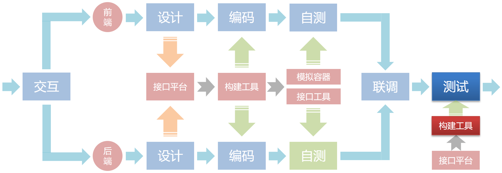

	通过构建工具对接接口管理平台生成测试代码和用例数据的大致过程如下图所示

	

	[大图地址](http://youfan.netease.com/res/ita1024/pic_10.gif)

	部署到持续集成平台Jenkins上

	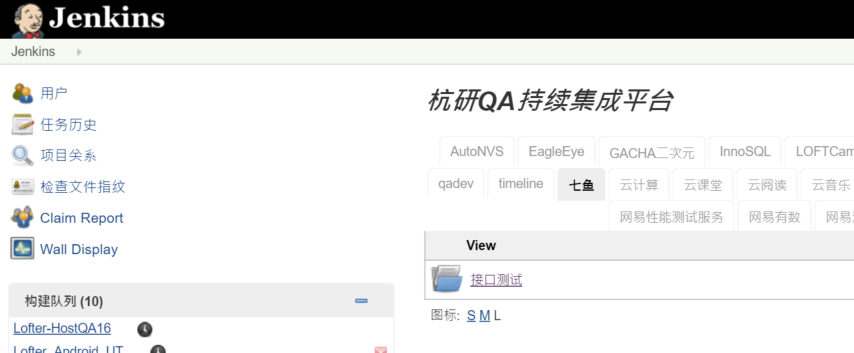

	提测时自动触发接口测试，并将测试结果以邮件形式反馈给相关测试工程师和研发工程师，接口的测试报告如下图所示，报告中红色的接口表示测试未通过的接口，需研发工程师再次检查接口管理平台上相关接口的定义

	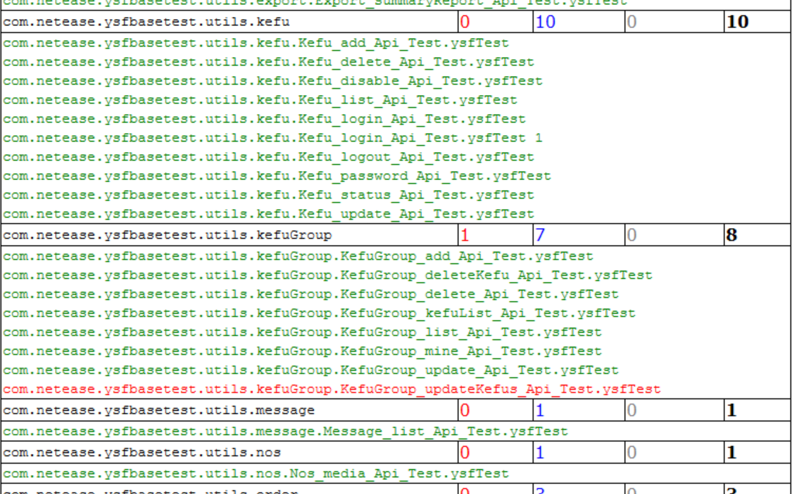

	出异常的接口的详细信息如下图所示
	
	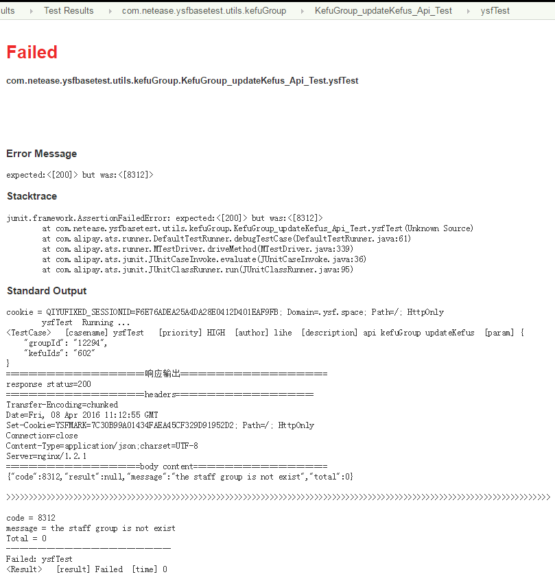

## 专题总结

此次专题主要跟大家分享了网易在前后端分离的一些实践解决方案，该方案在设计过程中主要从以下几方面进行考量：

* 低侵入性： 对老项目能够无侵入式引入并优化项目协作过程
* 高效率性： 通过接口管理平台输出协作规范使得各端可以完全独立并行进行，提供丰富的效率工具支持使得各端可以高效生产，随后可进行无缝联调衔接
* 高通用性： 可适应到各种后端环境的新老项目、接口管理平台的规范可以通过效率工具自动生成各种语言代码
* 高扩展性： 模拟容器支持的模板可扩展、利用接口管理平台的数据可扩展出更多面向各端开发者的效率工具
* 可验证性： 闭环可验证的一致性保证，通过测试环节对接接口管理平台自动化测试保证平台上数据的一致性
* 可操作性： 具有从交互到上线完整的生产线支持，具有可具体实施的流程规范及操作步骤

目前网易内部已经有250+项目使用了接口管理平台来管理接口规范，完整体系已应用到如网易七鱼云客服、网易云课堂、网易考拉海淘等产品中，该方案也在不断的改进完善中（如接口管理平台对移动端视图规范支持、接口测试工具中的用例数据管理及导出、效率工具数据采集方案、精简本地模拟容器等等），后面等各方面比较成熟后也会考虑开源整套体系所涉及的平台、工具等接受更大的挑战

